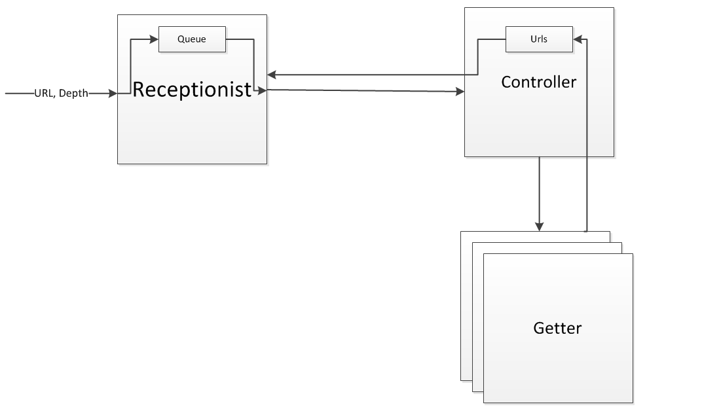

# Akka presentation: Akka with FSM

## Slides
[Slides on Slideshare](http://www.slideshare.net/krivachy/the-dark-side-of-akka-redacted)

## Actor example used

## FSM

[Akka FSM documentation](http://doc.akka.io/docs/akka/snapshot/scala/fsm.html)

## Requirements (or rather versions used):
* JDK 1.7.0.67
* Scala 2.11.2
* Akka 2.3.5

